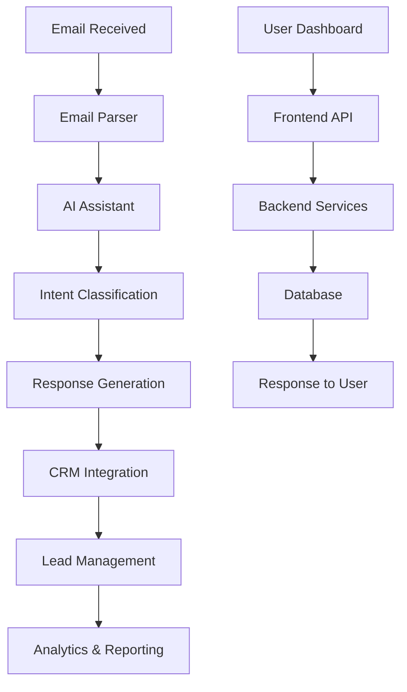

# Fikiri Solutions - System Architecture Documentation

## Table of Contents
1. [System Overview](#system-overview)
2. [Architecture Components](#architecture-components)
3. [Data Flow](#data-flow)
4. [API Documentation](#api-documentation)
5. [Database Schema](#database-schema)
6. [Security Implementation](#security-implementation)
7. [Deployment Architecture](#deployment-architecture)
8. [Monitoring & Observability](#monitoring--observability)
9. [Troubleshooting Guide](#troubleshooting-guide)
10. [Development Workflow](#development-workflow)

## System Overview

Fikiri Solutions is an AI-powered email automation platform designed for industry-specific businesses. The system provides intelligent email processing, lead management, and automated responses using machine learning and natural language processing.

### Key Features
- **AI Email Processing**: Intelligent email parsing and response generation
- **CRM Integration**: Automated lead creation and management
- **Industry-Specific Automation**: Tailored workflows for landscaping, restaurant, medical, etc.
- **Real-time Analytics**: Performance metrics and business intelligence
- **Multi-tenant Architecture**: Secure, scalable multi-user system

### Technology Stack
- **Frontend**: React 18, TypeScript, Tailwind CSS, Framer Motion
- **Backend**: Flask, Python 3.13, SQLite, Redis
- **AI/ML**: OpenAI GPT-4, Custom ML models
- **Deployment**: Render (Backend), Vercel (Frontend)
- **Monitoring**: Custom performance monitoring, Vercel Analytics

## Architecture Components

### Frontend Architecture
```
src/
├── components/          # Reusable UI components
├── pages/              # Route-based page components
├── contexts/           # React context providers
├── hooks/              # Custom React hooks
├── services/           # API service layers
├── utils/              # Utility functions
└── config/             # Configuration files
```

### Backend Architecture
```
core/
├── minimal_ai_assistant.py      # AI processing engine
├── minimal_crm_service.py       # CRM functionality
├── minimal_email_parser.py      # Email parsing logic
├── enterprise_security.py       # Security implementation
├── performance_monitor.py        # Performance tracking
├── structured_logging.py        # Logging system
└── business_operations.py       # Business logic
```

### Data Flow



## API Documentation

### Authentication Endpoints

#### POST /api/auth/login
Authenticate user and create session.

**Request Body:**
```json
{
  "email": "user@example.com",
  "password": "password123"
}
```

**Response:**
```json
{
  "success": true,
  "data": {
    "user": {
      "id": "user_id",
      "email": "user@example.com",
      "name": "User Name",
      "role": "user"
    },
    "session_id": "session_token"
  },
  "message": "Login successful"
}
```

#### POST /api/auth/logout
Terminate user session.

**Response:**
```json
{
  "success": true,
  "message": "Logout successful"
}
```

### CRM Endpoints

#### GET /api/crm/leads
Retrieve all leads for the authenticated user.

**Response:**
```json
{
  "success": true,
  "data": {
    "leads": [
      {
        "id": "lead_id",
        "name": "Lead Name",
        "email": "lead@example.com",
        "phone": "+1-555-123-4567",
        "company": "Company Name",
        "stage": "new",
        "score": 85,
        "created_at": "2024-01-18T10:00:00Z",
        "last_contact": "2024-01-18T10:00:00Z"
      }
    ],
    "count": 1
  },
  "message": "Leads retrieved successfully"
}
```

#### POST /api/crm/leads
Create a new lead.

**Request Body:**
```json
{
  "name": "Lead Name",
  "email": "lead@example.com",
  "phone": "+1-555-123-4567",
  "company": "Company Name",
  "source": "web",
  "notes": "Initial inquiry about services"
}
```

### AI Assistant Endpoints

#### POST /api/ai/chat
Process AI chat message and generate response.

**Request Body:**
```json
{
  "message": "I need help with my landscaping project",
  "context": {
    "user_id": "user_id",
    "session_id": "session_id"
  }
}
```

**Response:**
```json
{
  "success": true,
  "data": {
    "response": "I'd be happy to help with your landscaping project!",
    "intent": "landscaping_inquiry",
    "confidence": 0.95,
    "suggested_actions": [
      "Schedule consultation",
      "Request quote",
      "View portfolio"
    ]
  },
  "message": "Response generated successfully"
}
```

### Metrics Endpoints

#### GET /api/metrics
Retrieve system and user metrics.

**Response:**
```json
{
  "success": true,
  "data": {
    "total_emails": 150,
    "active_leads": 25,
    "ai_responses": 120,
    "avg_response_time": 2.5,
    "conversion_rate": 0.15,
    "user_satisfaction": 4.8
  },
  "message": "Metrics retrieved successfully"
}
```

## Database Schema

### Users Table
```sql
CREATE TABLE users (
    id TEXT PRIMARY KEY,
    email TEXT UNIQUE NOT NULL,
    name TEXT NOT NULL,
    password_hash TEXT NOT NULL,
    role TEXT NOT NULL DEFAULT 'user',
    company TEXT,
    industry TEXT,
    created_at TIMESTAMP DEFAULT CURRENT_TIMESTAMP,
    updated_at TIMESTAMP DEFAULT CURRENT_TIMESTAMP,
    is_active BOOLEAN DEFAULT TRUE
);
```

### Leads Table
```sql
CREATE TABLE leads (
    id TEXT PRIMARY KEY,
    user_id TEXT NOT NULL,
    name TEXT NOT NULL,
    email TEXT NOT NULL,
    phone TEXT,
    company TEXT,
    source TEXT DEFAULT 'web',
    stage TEXT DEFAULT 'new',
    score INTEGER DEFAULT 0,
    notes TEXT,
    created_at TIMESTAMP DEFAULT CURRENT_TIMESTAMP,
    updated_at TIMESTAMP DEFAULT CURRENT_TIMESTAMP,
    last_contact TIMESTAMP,
    FOREIGN KEY (user_id) REFERENCES users(id)
);
```

### Sessions Table
```sql
CREATE TABLE sessions (
    id TEXT PRIMARY KEY,
    user_id TEXT NOT NULL,
    ip_address TEXT,
    user_agent TEXT,
    created_at TIMESTAMP DEFAULT CURRENT_TIMESTAMP,
    expires_at TIMESTAMP NOT NULL,
    is_active BOOLEAN DEFAULT TRUE,
    FOREIGN KEY (user_id) REFERENCES users(id)
);
```

### Email Logs Table
```sql
CREATE TABLE email_logs (
    id TEXT PRIMARY KEY,
    user_id TEXT NOT NULL,
    lead_id TEXT,
    email_type TEXT NOT NULL,
    subject TEXT,
    body TEXT,
    response TEXT,
    intent TEXT,
    confidence REAL,
    processed_at TIMESTAMP DEFAULT CURRENT_TIMESTAMP,
    FOREIGN KEY (user_id) REFERENCES users(id),
    FOREIGN KEY (lead_id) REFERENCES leads(id)
);
```

## Security Implementation

### Authentication & Authorization
- **JWT Tokens**: Secure session management with expiration
- **Password Hashing**: bcrypt with salt rounds
- **Role-Based Access**: User, admin, super_admin roles
- **Session Management**: Secure session storage and validation

### Input Validation
- **API Validation**: Comprehensive request validation using Pydantic
- **SQL Injection Prevention**: Parameterized queries
- **XSS Protection**: Input sanitization and output encoding
- **CSRF Protection**: Token-based CSRF protection

### Security Headers
```python
# Security headers implemented
{
    "X-Content-Type-Options": "nosniff",
    "X-Frame-Options": "DENY",
    "X-XSS-Protection": "1; mode=block",
    "Strict-Transport-Security": "max-age=31536000; includeSubDomains",
    "Content-Security-Policy": "default-src 'self'"
}
```

### Rate Limiting
- **API Rate Limiting**: 50 requests per hour per user
- **Login Rate Limiting**: 5 attempts per 15 minutes
- **IP-based Limiting**: 100 requests per hour per IP

## Deployment Architecture

### Backend Deployment (Render)
```yaml
# render.yaml
services:
  - type: web
    name: fikiri-backend
    env: python
    buildCommand: pip install -r requirements.txt
    startCommand: gunicorn --bind 0.0.0.0:$PORT app:app
    plan: starter
    envVars:
      - key: FLASK_ENV
        value: production
      - key: SECRET_KEY
        generateValue: true
      - key: DATABASE_URL
        value: sqlite:///data/fikiri.db
      - key: REDIS_URL
        value: redis://localhost:6379
```

### Frontend Deployment (Vercel)
```json
// vercel.json
{
  "buildCommand": "npm run build",
  "outputDirectory": "dist",
  "framework": "vite",
  "headers": [
    {
      "source": "/(.*)",
      "headers": [
        {
          "key": "Cache-Control",
          "value": "no-cache, no-store, must-revalidate, max-age=0"
        }
      ]
    }
  ]
}
```

### Environment Configuration
```bash
# Production Environment Variables
FLASK_ENV=production
SECRET_KEY=generated_secret_key
DATABASE_URL=sqlite:///data/fikiri.db
REDIS_URL=redis://localhost:6379
OPENAI_API_KEY=your_openai_key
CORS_ORIGINS=https://fikirisolutions.vercel.app
```

## Monitoring & Observability

### Performance Monitoring
- **Response Time Tracking**: API endpoint performance monitoring
- **Error Rate Monitoring**: Failed request tracking
- **Resource Usage**: CPU, memory, disk usage monitoring
- **Database Performance**: Query execution time tracking

### Logging System
```python
# Structured logging implementation
{
    "timestamp": "2024-01-18T10:00:00Z",
    "level": "INFO",
    "message": "API request processed",
    "service": "fikiri-backend",
    "module": "api_handler",
    "function": "process_request",
    "line": 42,
    "user_id": "user_123",
    "request_id": "req_456",
    "response_time": 0.125
}
```

### Health Checks
- **API Health**: `/api/health` endpoint
- **Database Health**: Connection and query testing
- **External Dependencies**: OpenAI API, Redis connectivity
- **Uptime Monitoring**: Automated uptime checks

### Alerting System
- **Error Alerts**: Critical error notifications
- **Performance Alerts**: Response time threshold breaches
- **Resource Alerts**: High CPU/memory usage
- **Security Alerts**: Failed login attempts, suspicious activity

## Troubleshooting Guide

### Common Issues

#### 1. API Endpoint Not Responding
**Symptoms**: 500/502/503 errors, timeout responses
**Causes**: 
- Database connection issues
- Redis connectivity problems
- High server load
- Code errors

**Solutions**:
```bash
# Check service status
curl https://fikirisolutions.onrender.com/api/health

# Check logs
tail -f logs/fikiri_$(date +%Y%m%d).log

# Restart service
# Via Render dashboard or CLI
```

#### 2. Database Connection Errors
**Symptoms**: "Database connection failed" errors
**Causes**:
- Database file corruption
- Insufficient disk space
- Permission issues

**Solutions**:
```bash
# Check database file
ls -la data/fikiri.db

# Check disk space
df -h

# Repair database
sqlite3 data/fikiri.db "PRAGMA integrity_check;"
```

#### 3. Frontend Build Failures
**Symptoms**: Vercel deployment failures
**Causes**:
- TypeScript errors
- Missing dependencies
- Build configuration issues

**Solutions**:
```bash
# Check TypeScript errors
npm run type-check

# Install dependencies
npm install

# Test build locally
npm run build
```

#### 4. AI Response Issues
**Symptoms**: Slow or failed AI responses
**Causes**:
- OpenAI API rate limits
- Network connectivity issues
- Invalid API keys

**Solutions**:
```bash
# Check OpenAI API status
curl https://api.openai.com/v1/models

# Verify API key
python -c "import openai; print(openai.api_key)"
```

### Performance Optimization

#### Database Optimization
```sql
-- Create indexes for better performance
CREATE INDEX idx_leads_user_id ON leads(user_id);
CREATE INDEX idx_leads_email ON leads(email);
CREATE INDEX idx_sessions_user_id ON sessions(user_id);
CREATE INDEX idx_email_logs_user_id ON email_logs(user_id);
```

#### Caching Strategy
```python
# Redis caching implementation
@cached(ttl=300, key_prefix="crm_leads")
def get_leads(user_id):
    # Cache leads for 5 minutes
    pass

@cached(ttl=60, key_prefix="user_metrics")
def get_user_metrics(user_id):
    # Cache metrics for 1 minute
    pass
```

#### Frontend Optimization
```typescript
// Code splitting and lazy loading
const Dashboard = lazy(() => import('./pages/Dashboard'));
const CRM = lazy(() => import('./pages/CRM'));

// Image optimization
<OptimizedImage
  src="/images/hero.jpg"
  alt="Hero image"
  width={800}
  height={600}
  priority={true}
/>
```

## Development Workflow

### Local Development Setup
```bash
# Backend setup
cd /path/to/fikiri
python -m venv venv
source venv/bin/activate
pip install -r requirements.txt
python app.py

# Frontend setup
cd frontend
npm install
npm run dev
```

### Testing Workflow
```bash
# Run all tests
npm run test
python -m pytest

# Run specific test suites
npm run test:unit
npm run test:integration
npm run test:e2e

# Run security tests
python scripts/red_team_security.py
python scripts/chaos_testing.py
```

### Code Quality
```bash
# Linting and formatting
npm run lint
npm run format
python -m black .
python -m flake8 .

# Type checking
npm run type-check
python -m mypy .
```

### Deployment Process
1. **Development**: Feature development in feature branches
2. **Testing**: Automated tests and manual testing
3. **Code Review**: Pull request review process
4. **Staging**: Deploy to staging environment
5. **Production**: Deploy to production after approval

### Monitoring Deployment
```bash
# Check deployment status
curl https://fikirisolutions.onrender.com/api/health

# Monitor logs
tail -f logs/fikiri_$(date +%Y%m%d).log

# Check frontend deployment
curl https://fikirisolutions.vercel.app
```

---

## Contact Information

**Technical Support**: support@fikirisolutions.com
**Documentation Issues**: docs@fikirisolutions.com
**Security Concerns**: security@fikirisolutions.com

**Last Updated**: January 18, 2024
**Version**: 1.0.0
**Maintainer**: Fikiri Solutions Development Team
